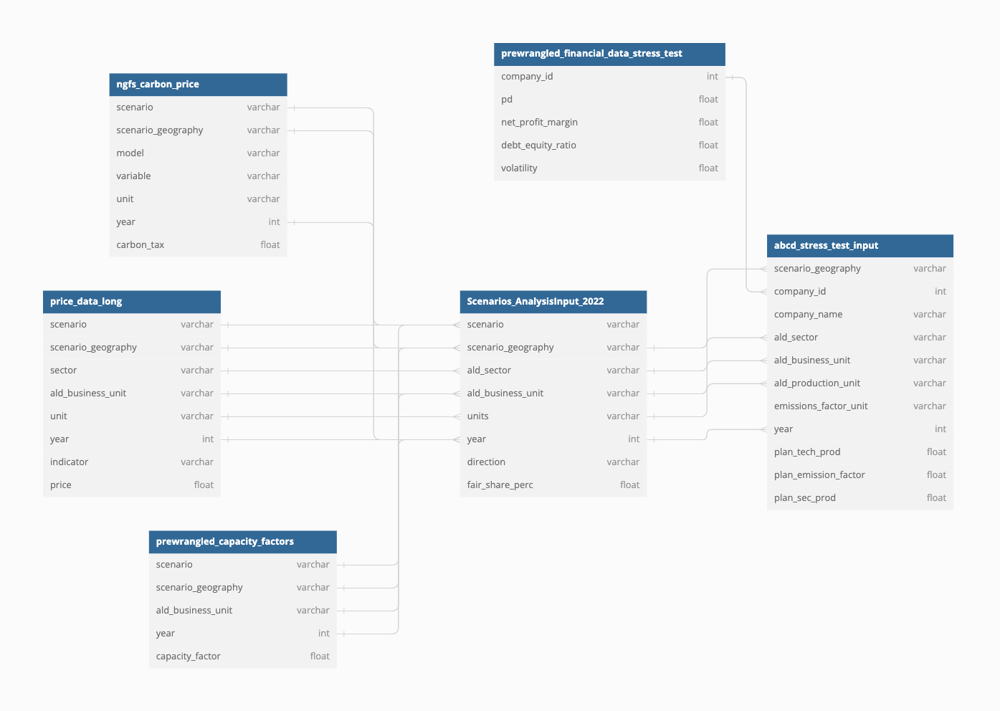

<!-- README.md is generated from README.Rmd. Please edit that file -->

```{r, include = FALSE}
knitr::opts_chunk$set(
  collapse = TRUE,
  comment = "#>",
  fig.path = "man/figures/README-",
  out.width = "100%"
)
```

<h1>
  ST input dataframes structure
  <span style="float: left;">
    <a href='https://github.com/2DegreesInvesting/r2dii.climate.stress.test'>
      
      
    </a>
  </span>
</h1>

The repository forms part of the LIFE STRESS project. The LIFE STRESS project has received funding from the LIFE Programme of the European Union. The contents of this publication are the sole responsibility of Theia Finance Labs and  do  not necessarily reflect  the  opinion  of the European Union. Project: 101074271 — LIFE21-GIC-DE-Stress. 

The preprocessing functions included in this repo have for purpose to generate dataframes to use as an input of the climate stress testing tool TRISK available on this repository :

TRISK input dataframes follow this structure : 




# STDataMGMT

The goal of STDataMGMT is to provide the input data required for the
stress test that cannot be shared as part of a public repository. The
2DII stress test needs several external data inputs that usually require
a license which prohibits redistributing the data. 2DII does not have
the right to publicly share that data though, which is why this
repository needs to stay private.The repository will be used to point
the main stress testing code to, when said data needs to be loaded. This
allows publishing the code containing 2DII's main climate stress testing
methodology open source.

The underlying logic of the data preparation is the following quintet:

1.  raw data are stored with the affix **raw\_** in the data-raw folder

2.  in the R folder the data preparation function is stored with the
    affix **prepare\_/aggregate\_**

3.  in the data-raw folder the file that calls the data preparation
    function is stored with the affix **run\_**

4.  prepared data are stored in the data-raw folder without affix

5.  in the test folder the test of the data preparation function is
    stored with the affix **test\_**


## Using the repository
- To generate all stress test input files, create the required inputs in `data-raw/DBs`, then run the `data-raw/run_workflow.R` file and retrieve the newly generated files in `data-raw` .
- An example usage of the preprocessing functions using synthetic data can be found in `vignettes/run_synthetic_workflow.Rmd`

## Inputs Dataframes Structure
### DB_ids.parquet

- generated by:
  - data_raw/prep_datalake.R
- description:
  - Contains the matching between IDs of different sources. 
- unique index : 
  - isin
  - company_id
- columns:
    -   isin: ISIN of a company. Multiple ISINs can match the same company_id. Can be NA if and only if company_id is not NA
    -   company_name: name of the company. Unique for each company_id
    -   company_id: id of a company. can be NA if and only if isin is not NA


### DB_assets_eikon.parquet
- generated by:
  - data_raw/prep_datalake.R
- description:
  - Contains financial features for different ISINs. 
- unique index:
  - isin
- columns:
  - isin: ISIN of company
  - ald_sector: location of the asset, in ISO2c format. Can be obtained from the first 2 characters of the ISIN.
  - net_profit_margin: net profit margin (between 0 and 1)
  - pd: probability of default of an asset (between 0 and 1)
  - debt_equity_ratio : debt equity ratio of an asset (between 0 and 1)
  - volatility: volatility of an asset (between 0 and 1)
  - asset_drift: drift of an asset (between 0 and 1)

### DB_company_activities.parquet
- generated by:
    - data_raw/prep_datalake.R
- description:
  - contains the production information for each company
- unique index:
  - company_id
  - ald_sector
  - ald_business_unit
  - ald_location
- columns:
  - company_id: id of the company
  - ald_sector: sector of the asset (ex: Power, Oil&Gas.. ) see `STDataMgmt::production_types$ald_sector` for all possible values
  - ald_business_unit: business unit of the asset (ex: RenewablesCap, OilCap) see `STDataMgmt::production_types$ald_business_unit` for all possible values.
  - ald_location: country where is located the asset, in ISO2c format
  - activity_unit: unit of the production (ex: MW, GJ, ...) see `STDataMgmt::production_types$ald_production_unit` for all possible values.
  - Equity Ownership YYYY : amount of production for a given year. 1 column per year.

### DB_company_emissions.parquet 
- generated by:
    - data_raw/prep_datalake.R
- description:
  - contains the emissions information for each company
- unique index:
  - company_id
  - ald_sector
  - ald_business_unit
  - ald_location
- columns:
  - company_id: id of the company
  - ald_sector: sector of the asset (ex: Power, Oil&Gas.. ) see `STDataMgmt::production_types$ald_sector` for all possible values
  - ald_business_unit: business unit of the asset (ex: RenewablesCap, OilCap) see `STDataMgmt::production_types$ald_business_unit` for all possible values.
  - ald_location: country where is located the asset, in ISO2c format
  - activity_unit: unit of the production (ex: tCO2, tCO2e) see `STDataMgmt::production_types$emissions_factor_unit` for all possible values.
  - Equity Ownership YYYY : amount of emissions for a given year. 1 column per year.

### DB_ownership_tree.parquet 
- generated by:
    - data_raw/prep_datalake.R
- description:
  - Contains the linking information between companies, parent and subsidiaries.
- unique index:
  - parent_company_id
  - subsidiary_company_id
- columns:
  - parent_company_id: the parent company_id
  - subsidiary_company_id: the subsidiary company_id
  - ownership_level: rank of the subsidiary towards the parent company. If equal to 0, then parent_company_id == subsidiary_company_id. If equal to 1, then the parent company is the highest parent of this subsidiary.


## Outputs Dataframes Structure
### prewrangled_financial_data_stress_test.csv
- generated by : 
  -  data-raw/run_prepare_prewrangled_financial_data_stress_test.R
- description:
  - Financial data input for the stress test.
- unique index:
  - company_id
- columns: 
  - company_id: the company id
  - pd: the probability of default
  - net_profit_margin: the net profit margin of a company
  - debt_equity_ratio: the debt equity ratio of a company
  - volatility: the volatility of a company
  - asset_drift: the asset drift of a company
  - net_profit_margin_rawdata_ratio : the ratio between financial indicators coming from the raw input data, and how many came from averages. The final indicator of a company can be mixed, as it can be an aggregate of indicators from multiple countries if a company owns assets in different countries.
  - debt_equity_ratio_rawdata_ratio: idem for debt_equity_ratio
  - volatility_rawdata_ratio: idem for volatiliy
  - asset_drift_rawdata_ratio: idem for asset_drift

### abcd_stress_test_input.csv
- generated by : 
  - data-raw/run_prepare_abcd_tress_test_input.R
- description :
  - production and emissions factor for different companies. An asset here refers to the eventual aggregation of the production and emissions of multiple ISINs from the raw company data (DB_company_activities and DB_company_emissions)
- unique index:
  - company_id
  - ald_sector
  - ald_business_unit
  - scenario_geography
  - year
- columns:
  - company_id: id of the company
  - company_name: name of the company
  - ald_sector: sector of the asset
  - ald_business_unit: business unit of the asset
  - scenario_geography: scenario geography of the asset
  - year: year of production
  - ald_production_unit: production unit of the asset
  - emissions_factor_unit: unit of the emission factor
  - plan_tech_prod: production in the ald_sector/ald_business_unit, for a given year
  - plan_emission_factor: emission in the ald_sector/ald_business_unit, for a given year
  - plan_sec_prod: production in the ald_sector, for a given year


<!-- badges: start -->

<!-- badges: end -->


## prepare_data.R - Functions for data preparation

### Preparation of scenario data

In order to get the scenario data into the required format as defined in
`r2dii.climate.stress.test`, the function `prepare_scenario_data()`
assumes that input in the format of data found on the dropbox under
***Processed Data*** is available. The input argument should point to a
corresponding file. The start year of the scenario file must be defined,
as does the output directory (NOT the file name). Please do not write
the output data to any directory in this repository, unless you are
specifically tasked with updating the default auxiliary files for the
2DII stress test.

**ADD INFO ON PACTA ROUTINE ONCE CLEAR**

### Preparation of production data

Production data preparation uses the PAMS dataset from Asset Resolution
as an input, which is stored on the dropbox under
***ST_INPUTS_PRODUCTION***. Start year, as well as time-horizon,
scenario sources, and sectors are defined manually.Data are aggregated
to company, technology, geography and year level and production as well
as emission factors are retained.

We remove entries with faulty or missing ownership information and
sectors that we cannot cover in the stress test as of now. Entries with
missing information on ALD locations are removed as well.For all entries
that have missing emission factors, we mean impute based on the
corresponding combination of country, technology, year or sub region,
technology, year.

### Preparation of capacity data

The function `prepare_prewrangled_capacity_factors_WEOYYYY()` reads in
raw power generation and capacity data and wrangles that data into the
required format for usage in `r2dii.climate.stress.test`. It uses input
files that are to be found on the dropbpox under **Raw_Data**, under
`WEOYYYY_Raw_Data.csv`, with YYYY being the year of the release of the
report.The user furthermore has to set a start year and an end year of
the preparation time frame. The start year should correspond with the
year of publication and the end year should be the same as the one used
in `r2dii.climate.stress.test`.

Beside wrangling the data into the expected format in terms of pivoting
and renaming columns, the function will linearly interpolate missing
values between the start and end years of the preparation time frame for
power generation and capacity. It will transform both indicators into
the same unit (GW) and calculate capacity factors per scenario, scenario
geography, sector, technology and year. It also ensures the
sector/technology breakdown is the same as in
`r2dii.climate.stess.test`, as long as the input file is an IEA WEO
release.

Lastly, the directory to which the resulting file will be written has to
be set. By default, the function will not overwrite any file within this
repository. So if you are trying to update the contents of the
repository, you will have to do that explicitly.

### Preparation of price data

The function `prepare_price_data_long_WEOYYYY()` reads price data based
on the raw data format provided by IEA WEO and wrangles that data into
clean long format.The start year has to be set manually. For fossil
fuels, price data by scenario is derived from **Ask Antonio**. For power
generation, data on the levelized cost of electricity (LCOE) by scenario
is taken from
<https://www.iea.org/articles/levelised-cost-of-electricity-calculator>
**Ask Antonio**. The function `prepare_lcoe_adjusted_price_data_weo()`
reads in the long format prepared price data from IEA scenarios and
filters LCOE for the power sector. Using the LCOE for power generation
implies that this indicator must be transformed into effective prices
for each company, by applying the following transformation:

-   LCOE = (1 - net_profit_margin) \* price
-   price = LCOE / (1 - net_profit_margin)

This transformation happens in `r2dii.cliamte.stress.test` though, as it
requires company level information.

We want to be able to use all data at least on a global granularity,
with additional layers of granularity being a nice-to-have. For some
variables, the raw data only contain a list of selected regional data.
In these cases, we approximate the global price as a simple arithmetic
mean of the regional prices. A more sophisticated approximation would
probably take into account the sizes of the markets and add some missing
regions, but for our purposes, this is still a reasonable approximation.
Specifically, we use this approximation for Coal and Gas extraction as
well as for all given types of power generation.

### Preparation of financial data

In order to obtain all relevant types of financial information for the
companies for which we have production data (abcd_stress_test_input), we
need to merge and clean the raw financial data from Eikon with the
companies data provided by Asset Resolution.

`prepare_financial_data()`  requires the following inputs : 
- **financial_data** the merge on isin between DB_ids and DB_assets_eikon. Not all isin have to match a company_id, but the highest the matching rate, the better quality will the output data be.
- **companies_data** DB_companies_activities. Brings the information on missing company_id and ald_sector column.
- **ownership_tree**  DB_ownership_tree
- **minimum_sample_size** minimum sample size tolerated to use an average
- **minimum_ratio_sample** minimum ratio of a sample tolerated to use an average
- **allowed_range_npm**  tolerated range for the net_profit margin, c(min_npm, max_npm)


`prepare_financial_data()` works by applying the following steps : 
- Remove implausible values from the raw data, by setting the cell where it appears to NA . Those values will be filled with averages later on.
- Using the country associated to each asset, map each country to a world region.  We're not using the scenarios regions, because that would create duplicate rows.
- When a company owns several assets in different countries, but same region, aggregate the financial indicators from country to region.
- Add new rows with NA financial value for the missing company_id from companies_data.
- If the ownership tree is provided as an input, match missing financial values of subsidiaries to their closest parent compahy, if the parent company has non-NA financial values in the raw data.
- Compute averages, and pick the most granular one possible to fill missing values
- As financial indicators are still at the (company_id, ald_sector, region) granularity level, aggregate those to the company level to be used in the stress test.

